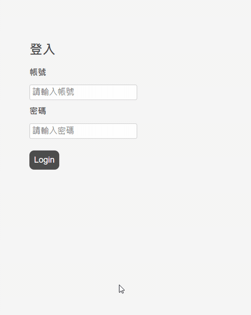
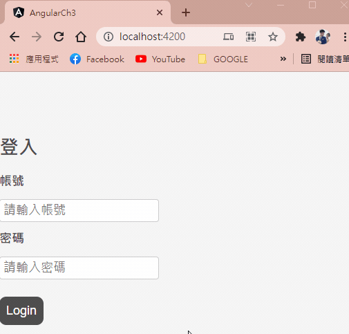
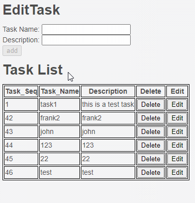
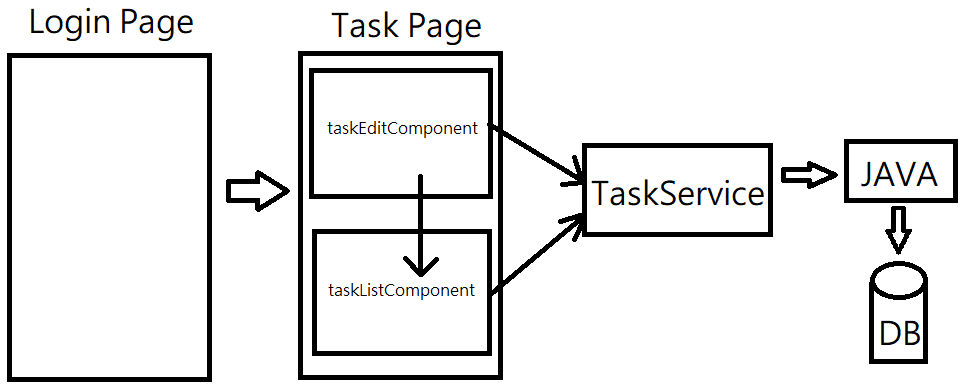

# Angular Fundamentals Self-Study and Quiz

## Chapter 3

本章節將練習使用 Angular完成簡單的任務清單頁面：

- 實作簡單的Login Page。
- 驗證邏輯不居，登入後頁面轉至Task Page。

- 若未輸入帳密直接前往Task Page，需導回Login Page並要求輸入帳密。

- Task Page內有：
	- 1.新增Task的區塊。
	- 2.顯示目前所有Task的區塊。
- 清單內容可以新增、編輯、刪除並存入DB。
- 處於編輯中的資料不能刪除。
- 若有資料處於編輯，則不能新增任務。

- 後端內容可續用spring part3，新增新的controller即可。
- DB 內容可續用java part3 task_table。
- 本題不提供專案，嘗試使用angular cli自行建立專案。

## 此練習需要使用到
- 自訂義Component
	- input
	- output
- Injectable
	- http client
- Route
	- Guard

## 架構可參考
